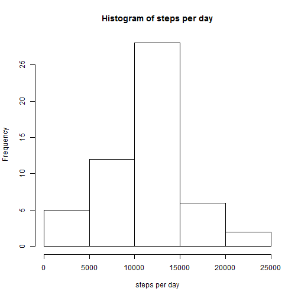
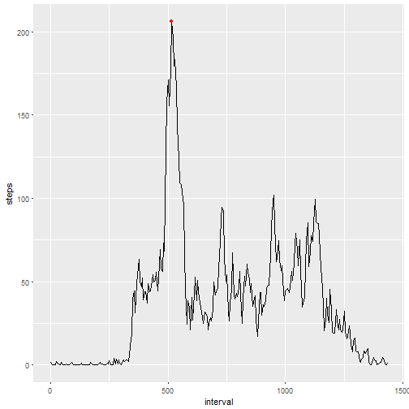
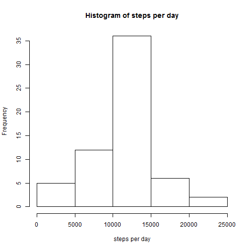
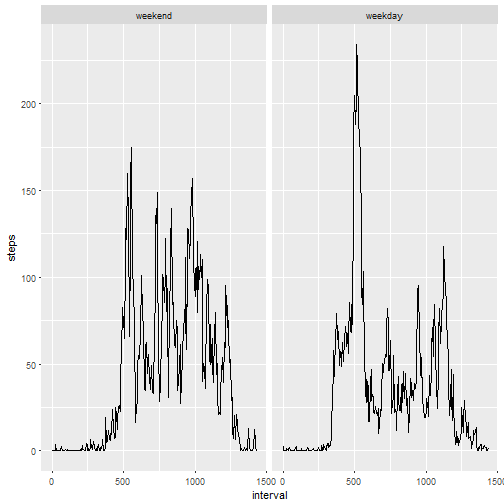

# Reproducible Research Assignment Project 1


### Loading and preprocessing the data


Code for reading the activity data from csv file:


```r
activity <- read.csv('activity.csv')
```


Upon inspection, the interval start minutes jump from x55 minutes to x00. Apparently, hours are erroneously counted as having 100 minutes.The following code fixes this flaw:


```r
activity$interval <- (activity$interval %/% 100) * 60 + activity$interval %% 100
```


### What is mean total number of steps taken per day?


Code for calculating the total number of steps per day and displaying a histogram:


```r
perday <- tapply(activity$steps,activity$date,sum)
hist(perday,main = 'Histogram of steps per day',xlab = 'steps per day')
```




Code for calculating the mean and median number of steps per day:


```r
mean <- mean(perday,na.rm=TRUE)
median <- median(perday,na.rm=TRUE)
```

Mean steps per day: 1.0766189 &times; 10<sup>4</sup>

Median steps per day: 10765


### What is the average daily activity pattern?


Code for calculating the average of each 5 minute interval and making a time series plot of it:


```r
meanperinterval <- aggregate(activity$steps,list(activity$interval),mean,na.rm = TRUE)
colnames(meanperinterval) <- c("interval","steps")
maxint <- which.max(meanperinterval$steps)
library(ggplot2)
ggplot(meanperinterval,aes(y=steps,x=interval)) +
  geom_line() +
  geom_point(x=meanperinterval[maxint,1],y=meanperinterval[maxint,2],color="red")
```



The 104th 5-minute interval, starting at 515 minutes and marked red in the graph, contains the maximum number of steps


### Imputing missing values


```r
missing <- is.na(activity$steps)
numbermissing <- sum(missing)
imputed <- activity  #copy original activity dataframe
# replace missing values with mean of that interval taken from meanperinterval data frame
imputed[which(missing),'steps'] <- round(meanperinterval[(which(missing) - 1) %% 288 + 1,'steps']) #use modulo to get daily interval index from total index, round to get integer number of steps

imputedperday <- tapply(imputed$steps,imputed$date,sum)
hist(imputedperday,main = 'Histogram of steps per day',xlab = 'steps per day')
```



```r
imputedmean <- mean(imputedperday,na.rm=TRUE)
imputedmedian <- median(imputedperday,na.rm=TRUE)
```

Mean steps per day in imputed data: 1.0765639 &times; 10<sup>4</sup> as opposed to 1.0766189 &times; 10<sup>4</sup> in original data.

Median steps per day in imputed data: 1.0762 &times; 10<sup>4</sup> as opposed to 10765 in original data.

The impact of imputing on the mean is small and due to the rounding to integer values. 
The impact on the median is small, too.

### Are there differences in activity patterns between weekdays and weekends?

Code to calculate interval averages for weekends and weekdays separately:


```r
activity$day <- factor(weekdays(as.Date(activity$date,"%Y-%m-%d")) %in% c('Saturday','Sunday'), levels=c(TRUE, FALSE), labels=c('weekend', 'weekday') )
meanperintday <- aggregate(activity$steps,list(activity$day,activity$interval), mean, na.rm=TRUE)
colnames(meanperintday) <- c('day','interval','steps')

ggplot(meanperintday,aes(y=steps,x=interval,group=day)) +
  geom_line() +
  facet_wrap(~ day)
```


